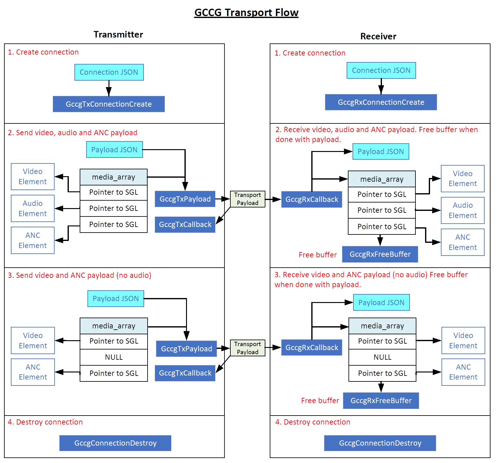

# Ground-Cloud-Cloud-Ground (GCCG) Transport API

This API is part of the VSF Technical Recommendation TR-xx Signal Transport and Timing Considerations for Ground-Cloud-Cloud-Ground workflows.

## Introduction

The recommendation concerns the interchange and timing of signals to-, from-, and within an interconnected composition of media processes within a composable compute environment (either private or multi-tenant, i.e. “cloud”).  In such systems, the time consumed performing a given process might be highly variable - we refer to these software-abstracted media processes here as  “Time-Non-Linear” Workflow Steps.
Additionally, this recommendation concerns the transport and interchange of media signals between Time-Linear (traditional method) and Time-Non-Linear processing paradigms, in order to facilitate the integration of real-time production media signals into composable compute environments.
It builds on (and references) other work within the VSF on related subjects.  A novel timing model is introduced for managing buffering and latency in the Time-Non-Linear processing paths.

The rest of this document describes some of the details of the API.

# API Overview

The API consists of public API data types, structures and functions. A "connection" is considered a single flow that may contain one or more media elements (video, audio and ancillary data). The diagram below shows an overview of the API usage flow:



# JSON strings

JSON is used by the API functions in order to pass configuration information.

## Transport Specific Parameters

Each different implementation must register a URN for its specific transport format, used in the “transport” key of the IS-04 sender and receiver declarations. The underlying implementation also defines a transport parameters structure specific to the implementation - this structure is indicated by the transport URN. In order to isolate the application from differing transport formats, the transport parameters structure shall be conveyed as a JSON-formatted object through the API and exposed in the related NMOS IS-05 sender and receiver structures.  It is the responsibility of the implementation provider to register a JSON schema and URN for its transport parameters object format in the AMWA NMOS Parameter Register.

The parameters are carried within the JSON string using the ```connection_json_ptr``` parameter of the  ```GccgTxConnectionCreate()``` and ```GccgRxConnectionCreate()``` API functions. The parent JSON key is ```"transportParameters"```. Refer to [connection schema](connection_schema.json) and [payload schema](connection_schema.json) files. A simplified example is shown below:

```
  "transportParameters": {
    ## Transport specific key/value pairs go here. A few are shown below: ##
    "transport": "urn:x-nmos:transport:rtp",
    "format": "urn:x-nmos:format:video",
    ...
    ## Additional key/values pairs ##
    ...
  }
```

## Create Connection APIs

The ```GccgTxConnectionCreate()``` and ```GccgRxConnectionCreate()``` API functions are used to create transmit and receive connections. JSON is used to pass parameters to the API and return information that is specific to the connection.


### ```connection_json_ptr```

This parameter points to a JSON string used to configure a new connection. The schema is located [here](connection_schema.json).

### ```ret_connection_json_str```

This parameter points to where returned connection data should be written in the form of a JSON string. The schema is located [here](ret_connection_schema.json).

## Transfer/Receive Payload APIs

The ```GccgRxCallback()``` callback API function is invoked when a payload has been received. The ```GccgTxPayload()``` API function is used to transmit a payload.

## ```payload_json_str```

This parameter points to a JSON string that is used for informational purposes when transmitting and receiving payloads. When transmitting, it can be use to define configurable changes to a payload. The schema is located [here](payload_schema.json).

# Uncompressed Video Data Format

Raw (uncompressed) video data is stored as 8 or 16 bit planar, two planar formats are proposed, one needs to be selected "TODO"

Option 1)

Y Plane of width x height samples

followed by

U Plane of width x height samples (444) or width x height/2 samples  (422)

followed by

V Plane of width x height samples (444) or width x height/2 samples  (422)

optionally followd by Alpha plane

Alpha Plane of width x height samples

This does not work well with segmented frames as the memory is not contiguous from segemnt to segment

YYYYYYYY........YYYYYYYY
........................
YYYYYYYY........YYYYYYYY
UUUU........UUUU
................
UUUU........UUUU
VVVV........VVVV
................
VVVV........VVVV

Option 2)

For each frame if not segemnted or for each sgement if segmentation is used height iterations of

Y Line of width samples

followed by

U Line of width samples (444) or width x height/2 samples  (422)

followed by

V Line of width samples (444) or width x height/2 samples  (422)

optionally followd by Alpha line

Alpha Line of width samples

This allows the concatenation of segments into a planar buffer that can be used as a siongle plane or a segemnts as required by the
implementation without any data shuffling beng needed.

In many common libraries this can be represent by setting the stride of all components to be the sum of the payload for each component.

plane or segment 1

YYYYYY.......YYYYYYYYUUUU........UUUUVVVV........VVVV
.....................................................
YYYYYY.......YYYYYYYYUUUU........UUUUVVVV........VVVV

If segmented then repeat segments till Segment 8, only planar or 8 segments supported

vnd.planar has been assigned from iana as a name, the email address GCCG@groups.vsf.tv has been used in request.

known formats in existing libraies, needs extending
GStreamer GST_VIDEO_FORMAT_Y444_16LE,
ffmpeg yuva422p16le yuv and alpha 16 bit 422
ffmpeg yuv422p16le yuv 16 bit 422
ffmpeg yuv422p yuv 8 bit 422
ffmpeg yuva422p yuv and alpha 8 bit 422
ffmpeg gbrap16le  rgb (gbr)and alpha 16 bit
ffmpeg gbrp rgb (gbr) 8 bit


# Compressed Video Data Formats

They shall be indentified by using the Internet Assigned Numbers Authority (IANA) video name strings, which can be found at https://www.iana.org/assignments/media-types/media-types.xhtml#video, for the JSON configuration "encodingName" element.

An example for H.264 compressed video is shown below:

```
"encodingName": "H264"
```

# Uncompressed Audio Format

32-bit float (uncompressed) audio data is stored in the following format:
```
             +----------------+
 1 sample:   | IEEE 754 float |
             +----------------+
```

Audio samples with multiple channels are interleaved. An example using multiple channels is shown below:
```
  +--------------------+--------------------+--------------------+--------------------+
  | sample 0 channel 0 | sample 0 channel 1 | sample 0 channel 2 | sample 0 channel 3 |
  +--------------------+--------------------+--------------------+--------------------+
  | sample 1 channel 0 | sample 1 channel 1 | sample 1 channel 2 | sample 1 channel 3 |
  +--------------------+--------------------+--------------------+--------------------+
                                           ...
  +--------------------+--------------------+--------------------+--------------------+
  | sample N channel 0 | sample N channel 1 | sample N channel 2 | sample N channel 3 |
  +--------------------+--------------------+--------------------+--------------------+
```

# Ancillary Data Format
Ancillary packet data is based on the packing model of RFC 8331, as shown below:
```
   0                   1                   2                   3
   0 1 2 3 4 5 6 7 8 9 0 1 2 3 4 5 6 7 8 9 0 1 2 3 4 5 6 7 8 9 0 1
  +-+-+-+-+-+-+-+-+-+-+-+-+-+-+-+-+-+-+-+-+-+-+-+-+-+-+-+-+-+-+-+-+
  |           ANC_Count           | F |         reserved          |
  +-+-+-+-+-+-+-+-+-+-+-+-+-+-+-+-+-+-+-+-+-+-+-+-+-+-+-+-+-+-+-+-+
```

The section below is repeated once for each ancillary data packet, as specified by ANC_Count.
```
  +-+-+-+-+-+-+-+-+-+-+-+-+-+-+-+-+-+-+-+-+-+-+-+-+-+-+-+-+-+-+-+-+
  |C|   Line_Number       |   Horizontal_Offset   |S|  StreamNum  |
  +-+-+-+-+-+-+-+-+-+-+-+-+-+-+-+-+-+-+-+-+-+-+-+-+-+-+-+-+-+-+-+-+
  |         DID       |        SDID       |   Data_Count      |
  +-+-+-+-+-+-+-+-+-+-+-+-+-+-+-+-+-+-+-+-+-+-+-+-+-+-+-+-+-+-+-+-+
                           User_Data_Words...
  +-+-+-+-+-+-+-+-+-+-+-+-+-+-+-+-+-+-+-+-+-+-+-+-+-+-+-+-+-+-+-+-+
                                  |   Checksum_Word   |word_align |
  +-+-+-+-+-+-+-+-+-+-+-+-+-+-+-+-+-+-+-+-+-+-+-+-+-+-+-+-+-+-+-+-+
```

# Transmission Order
Payload buffers will be transmitted in the order in which the GccgTxPayload() function is called and then delivered to the recieve callback in the same order

The API is not responsible for re-ordering of payload buffers using timestamps, this is the responsibility of the user of the API to trasnmit in the correct order or re-order on reciept.


